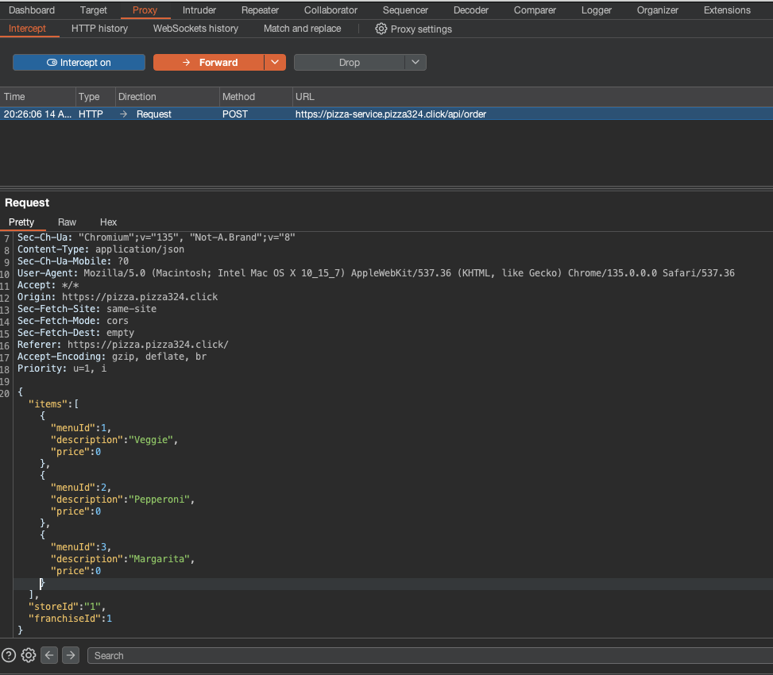
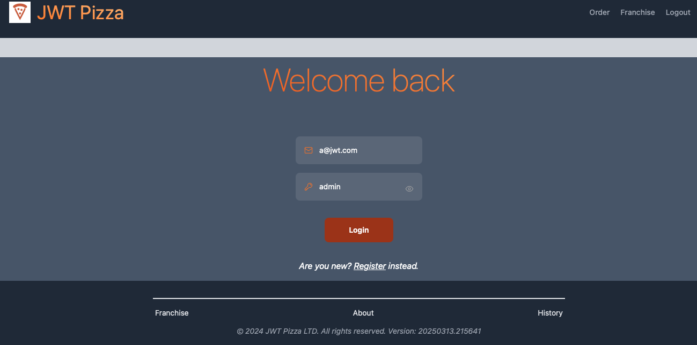
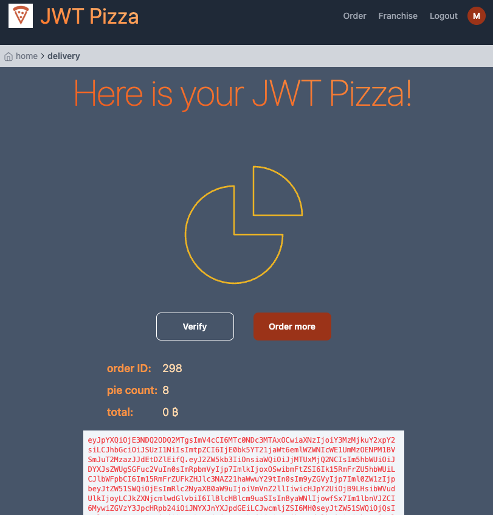
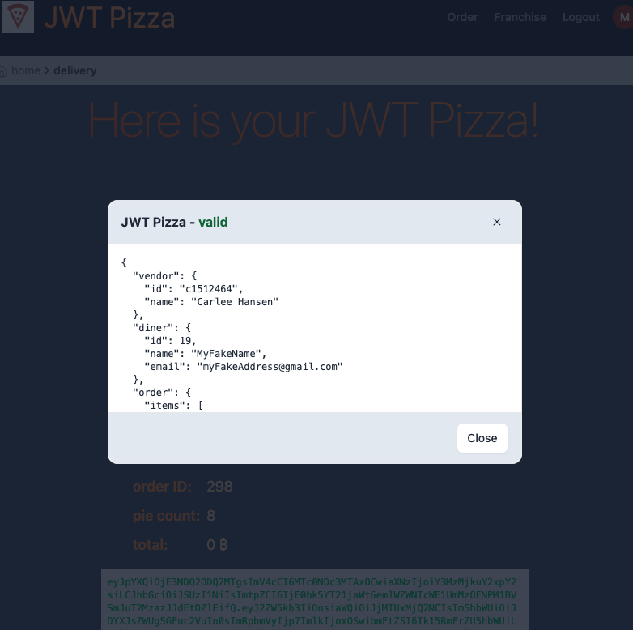
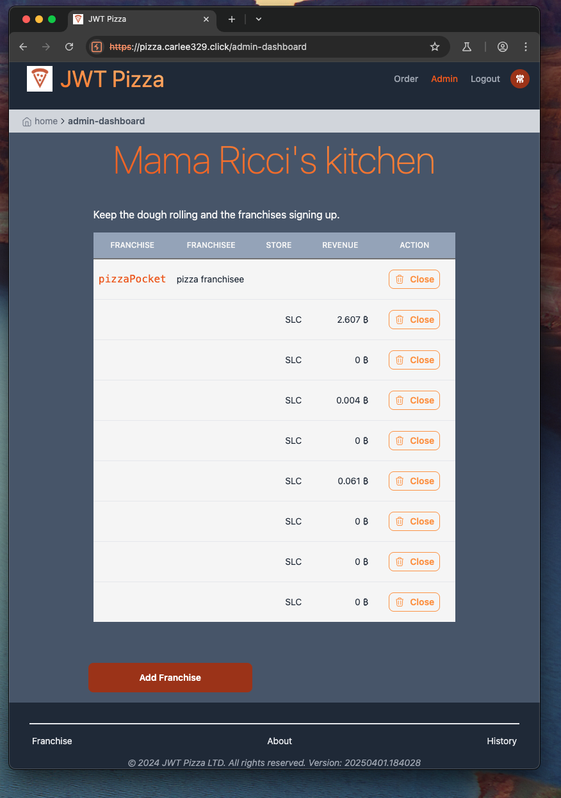
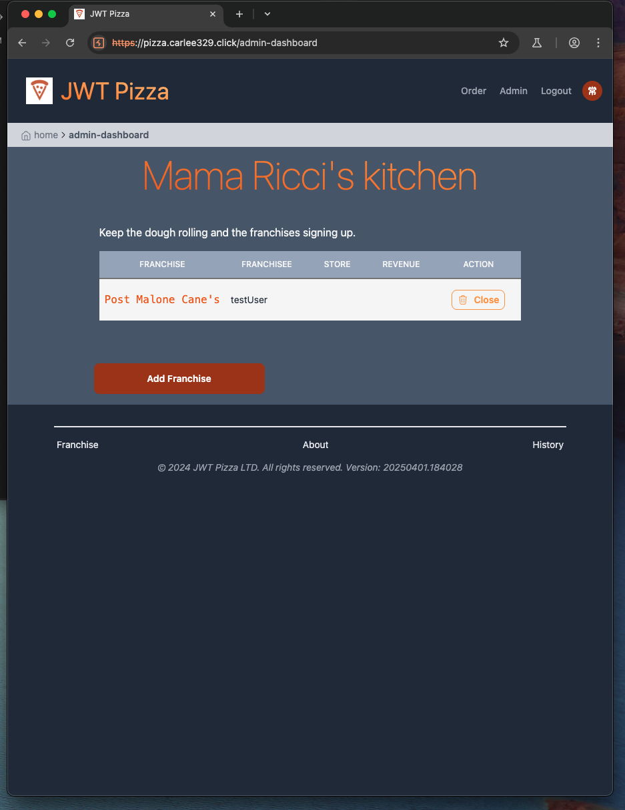

# David Sumsion & Carlee Hansen Peer Attack

## Self Attack

### David:

#### Poor Design w/ purchasing pizzas
| Item           | Result                                                                         |
| -------------- | ------------------------------------------------------------------------------ |
| Date           | April 9, 2025                                                                  |
| Target         | pizza.pizza324.click                                                           |
| Classification | Poor Design                                                                    |
| Severity       | 1                                                                              |
| Description    | Able to purchase pizzas for any price if call is intercepted in BurpSuite and changed!!    |
| Image          |   <br/>                                            |
| Corrections    | Called DB and verified the price from the front end matched the database before allowing user to purchase                |

#### Brute Force
```
Note: I decided not to officially run this command on my own server to avoid AWS charges.
```
| Item           | Result                                                                         |
| -------------- | ------------------------------------------------------------------------------ |
| Date           | April 9, 2025                                                                  |
| Target         | pizza.pizza324.click                                                           |
| Classification | Brute Force Attempts/DDOS                                                      |
| Severity       | 2                                                                              |
| Description    | Able to brute force call the authentication credentials repetetely. Could DDOS |
| Corrections    | Allow a few requests per IP address per minute                                 |

#### Default Credentials
| Item           | Result                                                                         |
| -------------- | ------------------------------------------------------------------------------ |
| Date           | April 9, 2025                                                                  |
| Target         | pizza.pizza324.click                                                           |
| Classification | Default Credentials                                                            |
| Severity       | 1                                                                              |
| Description    | Able to delete (close) any/all stores/franchises as well as make any franchise/store     |
| Image          |   <br/>                                            |
| Corrections    | Removed default credentials, made new ones, and wiped DB                       |


### Carlee:


## Peer Attack
```
Note: We previously agreed before the peer attack to not do any brute force attacks as to not incur extra charges on our AWS accounts
```
#### David:

#### Poor Design w/ purchasing pizzas
| Item           | Result                                                                         |
| -------------- | ------------------------------------------------------------------------------ |
| Date           | April 14, 2025                                                                  |
| Target         | pizza.carlee329.click                                                          |
| Classification | Poor Design                                                                    |
| Severity       | 1                                                                              |
| Description    | Able to purchase pizzas for any price if call is intercepted in BurpSuite and changed!! Purchased up to 20 pizzas at a time for free   |
| Image          |   <br/>                                            |
| Image          |   <br/>                                            |
| Corrections    | Call DB to verify if there are any differences between the menu items and the title and price              |

#### Default Credentials
| Item           | Result                                                                         |
| -------------- | ------------------------------------------------------------------------------ |
| Date           | April 14, 2025                                                                  |
| Target         | pizza.carlee329.click                                                         |
| Classification | Default Credentials                                                            |
| Severity       | 1                                                                              |
| Description    | Able to delete (close) any/all stores/franchises as well as make any franchise/store     |
| Image          |   <br/>                                            |
| Image          |   <br/>                                            |
| Corrections    | Change default credentials of Admin                     |


### Carlee:


## Combined Summary of Learnings
This was a fun and informative learning experience. Our findings were that our websites
were vulnerable for various things including Brute Force Attacks, Poor Design, & 
Default Credentials. Little things overlooked or shortcutted in development can lead to
massive issues once a system has users. 